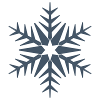
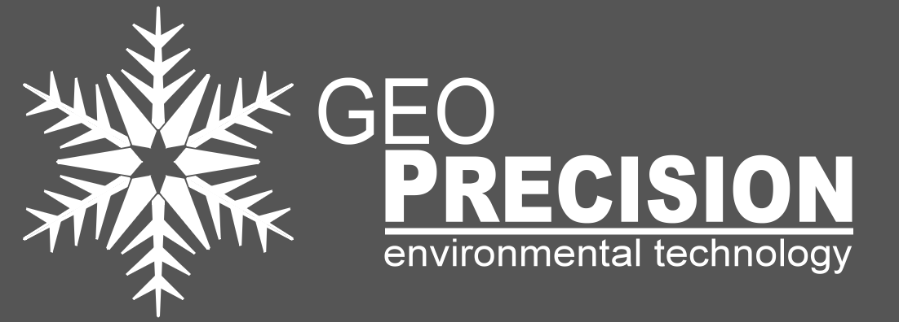

# Geoprecision Logo Schneeflocke (SVG)

(C) GeoPrecision GmbH - 2025

Dieses Projekt dient der Bearbeitung der Schneeflocke aus dem Geoprecision-Logo als SVG-Datei.

## Vorschau der SVG-Datei

Hier ist die Schneeflocke als SVG eingebunden:

## Verwendung der PNG-Dateien

Im Ordner `bilder` befinden sich zwei PNG-Dateien, die ebenfalls Teil des Projekts sind (und die Datei mit Objekten (`GP_objects.ufo`)):

### Geoprecision-Logo in Grau

### Geoprecision-Logo in Rot

## Quellen zur Verwendung

- [Geoprecision Website](https://geoprecision.com/)
- [PlantSensor Website](https://www.plantsensor.de/)